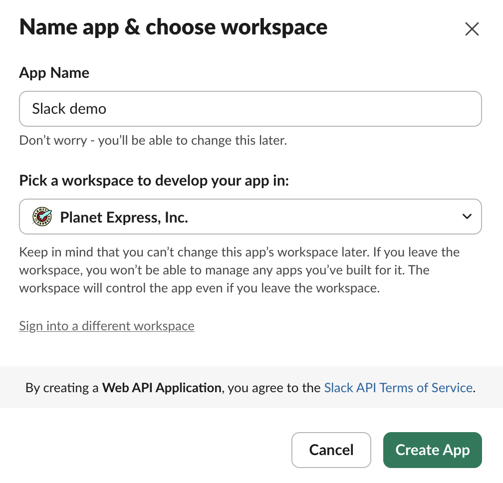
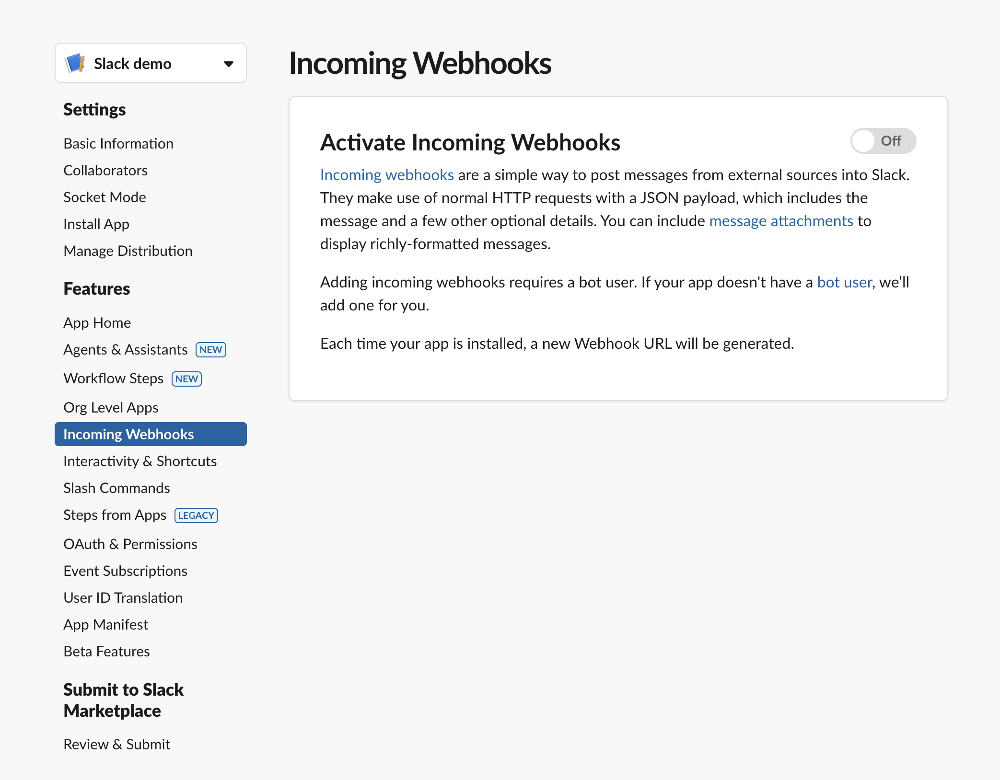
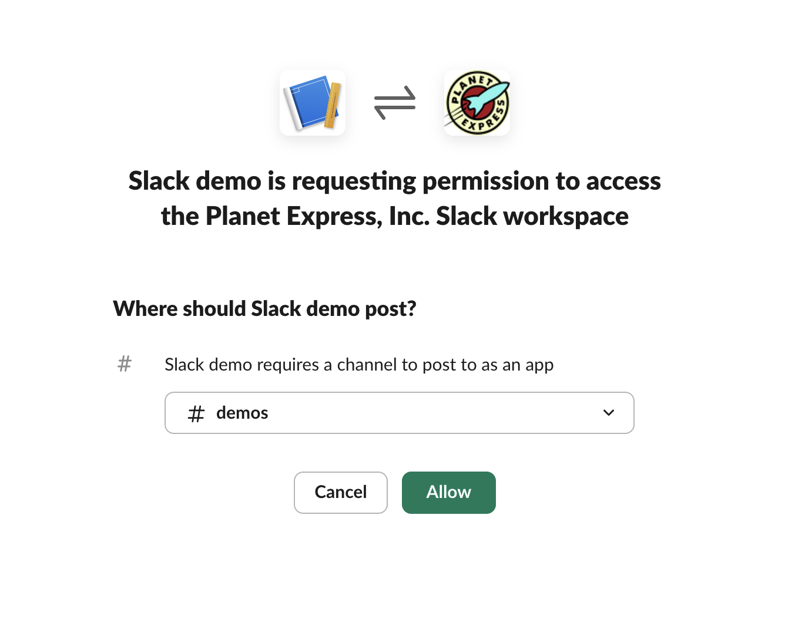

Hello World
===========

This example sends a message to a Slack channel.


```console

ftl-agent --tools-files ../tools/tools.py \
          -t complete \
          -t slack \
          -s "A linux machine" \
          -M ../modules \
          -p "Send message to Slack, and call complete when done" \
          -e "slack_token=${SLACK_TOKEN}"
```

`ftl-agent` CLI takes a number of arguments.  These are:

* `--tools-files` - the path to a python file containing tools that can be used in your agent.
* `-t complete` - This enables the complete tool.  Each tool needs to be enable for the agent.
* `-t slack` - Enable the slack tool.
* `-s "A linux machine"` - This is the system design that the agent is working to automate.
* `-M ../modules` - the path to your automation modules.
* `-p "Send message to Slack, and call complete when done"` - The problem statement for your agent to automate.
* `-e "slack_token=${SLACK_TOKEN}"` - Secrets should be passed as environment variables to the agent.


You'll need a Slack application and a incoming webhook setup.


To set up an incoming slack webhook we need to create an app here [https://api.slack.com/apps](https://api.slack.com/apps).


Set the app name:




Then create in incoming webhook for that app here:




Turn it on:


Give it permission:




Then we can get the token from the webhook URL and paste it into an environment variable:

```console
export SLACK_TOKEN='<token>'
```
